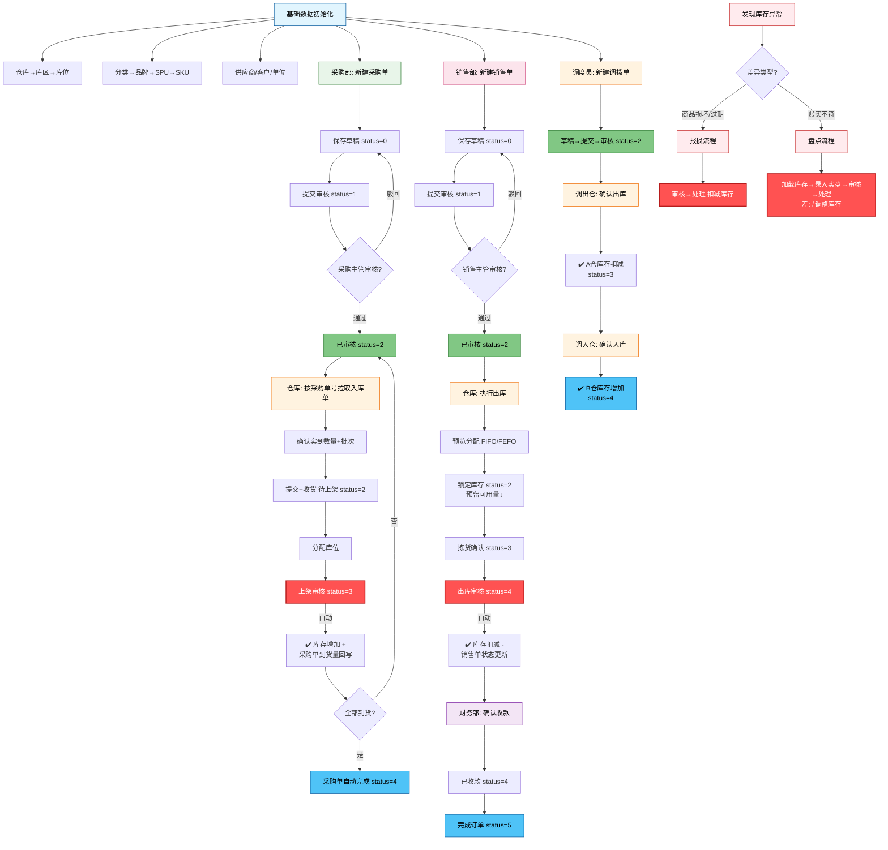
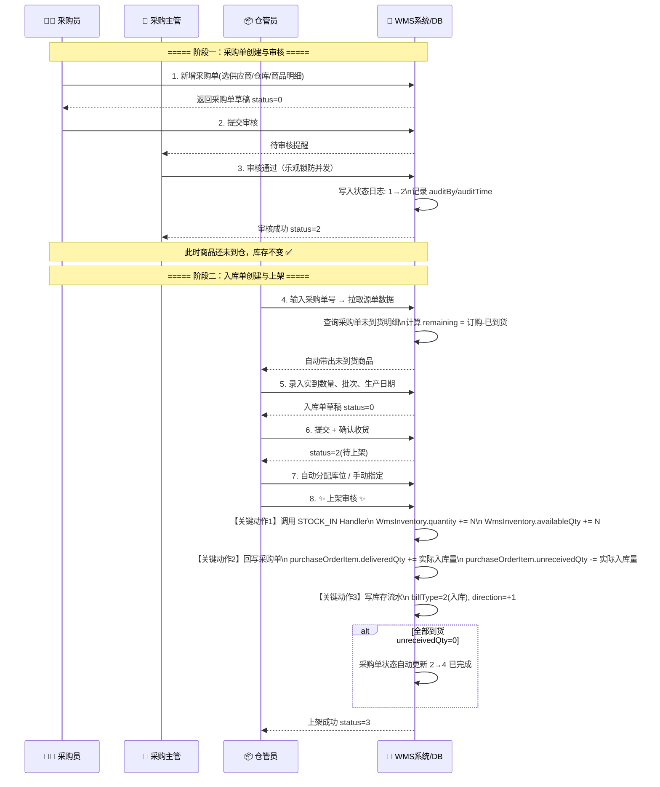
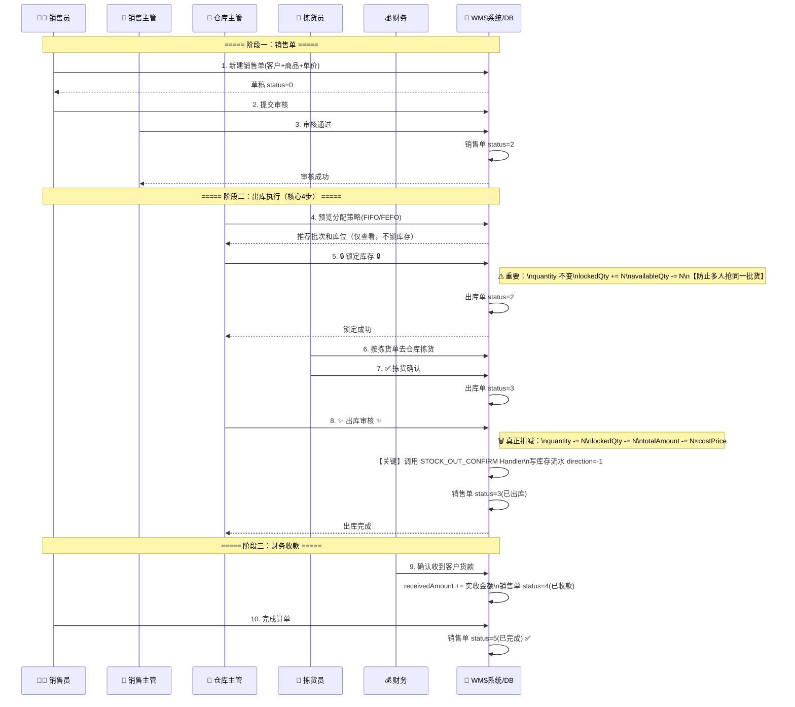
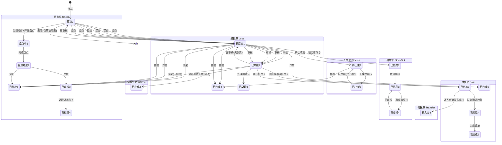
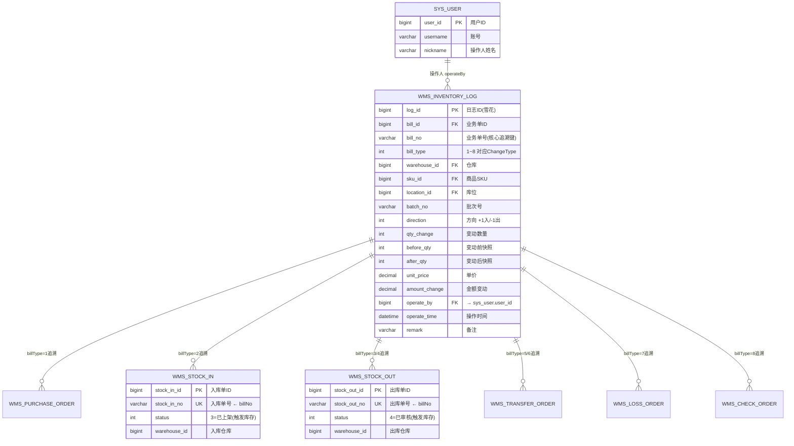
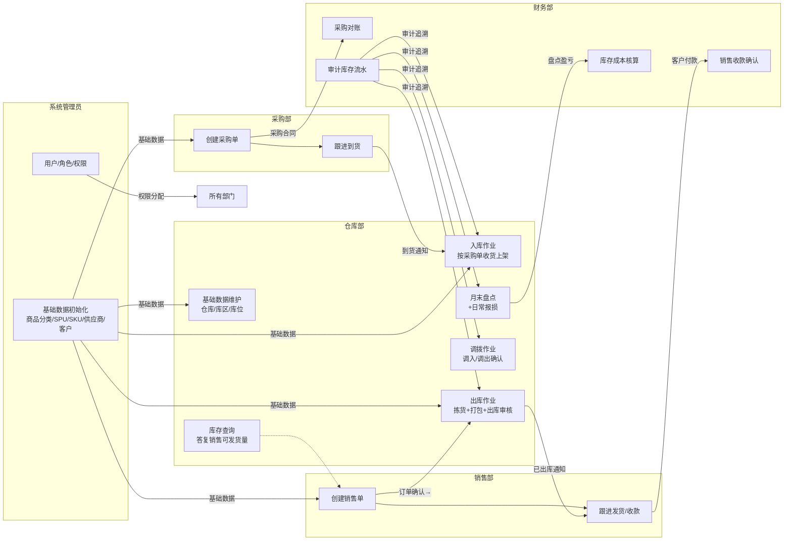

# WMS 系统 - 业务流程图 & 数据变更导图

> 版本：v1.0 | 更新日期：2026-08-26
> 
> 说明：本文件使用 Mermaid 语法绘制流程图，支持在 Typora、VSCode(Mermaid插件)、GitHub、Notion 等环境直接渲染。

---

## 目录

1. [WMS 端到端全业务流程图](#1-wms-端到端全业务流程图)
2. [采购→入库 协同流程图](#2-采购入库-协同流程图)
3. [销售→出库 协同流程图](#3-销售出库-协同流程图)
4. [仓库调拨 双仓协同流程图](#4-仓库调拨-双仓协同流程图)
5. [盘点业务 详细流程图](#5-盘点业务-详细流程图)
6. [报损业务 流程图](#6-报损业务-流程图)
7. [全单据状态机 汇总图](#7-全单据状态机-汇总图)
8. [库存数据变更 核心导图（重中之重）](#8-库存数据变更-核心导图重中之重)
9. [库存流水追溯 关系图](#9-库存流水追溯-关系图)
10. [各部门职责与协作 泳道图](#10-各部门职责与协作-泳道图)

---

## 1. WMS 端到端全业务流程图



---

## 2. 采购→入库 协同流程图



---

## 3. 销售→出库 协同流程图



---

## 4. 仓库调拨 双仓协同流程图

```mermaid
flowchart LR
    subgraph 调度中心
        D[调度员: 新建调拨单]:::s --> D1[提交审核]
        D1 --> D2[主管审核 status=2]:::s
    end

    subgraph 🏭 A仓库 - 调出方
        direction TB
        D2 --> AO[A仓仓管员看到待发货]:::a
        AO --> A1[核对商品]
        A1 --> A2[✅ 确认出库]:::critical
        A2 --> A3[调用 TRANSFER_OUT Handler]
        A3 --> A4[(A仓库存)]:::db
        A4 -. quantity↓ .-> A5[A仓库存扣减成功]
        A2 -->|status 2→3| TS[调拨单: 已出库]:::mid
    end

    subgraph 🏭 B仓库 - 调入方
        direction TB
        TS --> BO[B仓仓管员看到待收货]:::b
        BO --> B1[实物验收]
        B1 --> B2[✅ 确认入库]:::critical
        B2 --> B3[调用 TRANSFER_IN Handler]
        B3 --> B4[(B仓库存)]:::db
        B4 -. quantity↑ .-> B5[B仓库存增加成功]
        B2 -->|status 3→4| TD[调拨单: 已入库完成]:::done
    end

    classDef s fill:#f3e5f5,stroke:#7b1fa2
    classDef a fill:#ffebee,stroke:#c62828
    classDef b fill:#e8f5e9,stroke:#2e7d32
    classDef critical fill:#ff5252,stroke:#b71c1c,color:#fff,stroke-width:2px
    classDef db fill:#bbdefb,stroke:#0d47a1
    classDef mid fill:#fff9c4,stroke:#f57f17
    classDef done fill:#4fc3f7,stroke:#01579b,color:#fff
```

**关键设计点**：调拨不一步到位，必须两个仓库分别确认 → 防止"调出方没发货但调入方说收到了"的扯皮问题。

---

## 5. 盘点业务 详细流程图

```mermaid
flowchart TD
    Start([月末/季末盘点]):::start --> A[新建盘点单]
    A --> A1[可选: 指定仓库/库区范围]
    A1 --> B[⚠️ 关键步骤: 加载库存数据]:::warn
    B --> B1[系统查询 wms_inventory\n生成盘点明细行:\nsystemQty = 当前库存数]
    B1 --> C[点击 开始盘点]
    C -->|status 0→1| D[盘点中 status=1\n前往仓库现场点数]

    D --> E{逐SKU录入实际数量}
    E --> E1[inputActual 接口\n每行写 actualQty]
    E1 -->|自动计算| E2[diffQty = actualQty - systemQty]
    E2 --> F{全部SKU录完?}
    F -->|否| E
    F -->|是| G[点击 完成盘点 status 1→2]

    G --> H[盘点差异汇总]:::report
    H --> H1[盘盈: diff > 0 / 实际多了]
    H --> H2[盘亏: diff < 0 / 实际少了]
    H --> H3[无差异: diff = 0]

    H1 --> I{主管审核差异原因}
    H2 --> I
    H3 --> I
    I -->|合理/通过| J[审核通过 status 2→3]
    I -->|不合理,需重盘| D

    J --> K[✨ 处理: 调整库存 ✨]:::critical
    K -->|盘盈 +| K1[调用 CHECK Handler\nquantity += diff]
    K -->|盘亏 -| K2[调用 CHECK Handler\nquantity -= |diff|]
    K -->|无差异| K3[库存不变，仅关单]
    K1 & K2 & K3 --> L[写库存流水 billType=8]
    L --> M[status 3→4 盘点完成]:::done

    classDef start fill:#e1f5fe,stroke:#01579b
    classDef warn fill:#ff9800,stroke:#e65100,color:#fff,stroke-width:2px
    classDef critical fill:#ff5252,stroke:#b71c1c,color:#fff,stroke-width:2px
    classDef report fill:#fff9c4,stroke:#f57f17
    classDef done fill:#4fc3f7,stroke:#01579b,color:#fff
```

---

## 6. 报损业务 流程图

```mermaid
flowchart TD
    A([发现异常商品]):::start --> B{异常原因?}
    B -->|过期/损坏/丢失| C[新建报损单]:::warn
    C --> C1[选商品+报损数量+报损原因]
    C1 --> D[保存草稿 status=0]
    D --> E[提交审核 status=1]
    E --> F{主管审核}
    F -->|不合理 退回| D
    F -->|通过| G[审核通过 status=2]

    G --> H[✨ 处理(扣减库存) ✨]:::critical
    H --> H1[调用 LOSS Handler\nChangeType=7]
    H1 --> H2[WmsInventory.quantity -= 报损数量\navailableQty 同步扣减]
    H1 --> H3[写库存流水:\nbillType=7, direction=-1]
    H2 & H3 --> I[status 2→3 报损完成]:::done

    classDef start fill:#ffebee,stroke:#c62828
    classDef warn fill:#ff9800,stroke:#e65100,color:#fff
    classDef critical fill:#ff5252,stroke:#b71c1c,color:#fff,stroke-width:2px
    classDef done fill:#4fc3f7,stroke:#01579b,color:#fff
```

---

## 7. 全单据状态机 汇总图



⭐ = 此步骤触发库存变动

---

## 8. 库存数据变更 核心导图（重中之重）

> 所有业务最终都会落到这张图。培训时建议将此图打印出来贴在仓库办公室。

```mermaid
flowchart TB
    %% ===== 核心库存表 =====
    Inv[(📦 WmsInventory 实时库存表\n\nwarehouseId + skuId + locationId + batchNo → 唯一键\n────────────────\n📊 quantity       总数量\n🔒 lockedQty      锁定量\n✅ availableQty   可用量 (= Q - L)\n💰 costPrice      成本价\n💵 totalAmount    总值)]:::db

    %% ===== 8种变更入口 =====
    subgraph 所有业务单据审核/处理节点 ⭐会触发Handler
        direction TB
        SI[入库单上架审核\nstatus=2→3]:::in
        SOL[出库单锁定库存\nstatus=1→2]:::lock
        SO[出库单审核\nstatus=3→4]:::out
        TO[调拨确认出库\nstatus=2→3]:::out
        TI[调拨确认入库\nstatus=3→4]:::in
        L[报损单处理\nstatus=2→3]:::out
        C[盘点单处理\nstatus=3→4]:::diff
        PR[采购退货审核]:::out
    end

    %% ===== Factory + Handler 统一处理层 =====
    Fac[🏭 InventoryChangeHandlerFactory\n根据 ChangeType.code 路由]:::factory
    SI -->|ChangeType=2 STOCK_IN| Fac
    SOL -->|ChangeType=3 STOCK_OUT_LOCK| Fac
    SO -->|ChangeType=4 STOCK_OUT_CONFIRM| Fac
    TO -->|ChangeType=5 TRANSFER_OUT| Fac
    TI -->|ChangeType=6 TRANSFER_IN| Fac
    L -->|ChangeType=7 LOSS| Fac
    C -->|ChangeType=8 CHECK| Fac
    PR -->|ChangeType=1 PURCHASE_RETURN| Fac

    %% ===== Handler 执行计算 =====
    H[⚙️ InventoryChangeHandler\n执行库存计算 + 版本号乐观锁]:::handler
    Fac --> H

    H -->|① 计算变动前快照| S1(beforeQty 记录)
    H -->|② 按规则更新数量| Upd
    H -->|③ 计算变动后快照| S2(afterQty 记录)

    %% ===== 更新库存表 =====
    subgraph 更新逻辑 Upd
        direction LR
        U1[STOCK_IN/TRANSFER_IN:\nQ += N, A += N]
        U2[STOCK_OUT_LOCK:\nL += N, A -= N\n❗Q不变]
        U3[STOCK_OUT_CONFIRM:\nQ -= N, L -= N]
        U4[LOSS/TRANSFER_OUT/P_RETURN:\nQ -= N, A -= N]
        U5[盘点 CHECK:\ndiff>0? Q+diff : Q-|diff|]
    end
    Upd --> Inv

    %% ===== 写流水 =====
    S1 & S2 --> Log[(📝 WmsInventoryLog\n审计流水表 - 永远INSERT不UPDATE\n────────────────\n📋 billId/billNo 追溯业务单\n🔢 billType 1~8\n➡️ direction +1入/-1出\n📦 qtyChange 变动量\n🔜 beforeQty → afterQty\n👤 operateBy/operateTime\n💵 unitPrice/amountChange)]:::db
    Log -->|通过billNo+billType反查| Bill[任意业务单据\n(采购/入库/出库/调拨/销售/报损/盘点)]:::doc

    %% ===== 样式 =====
    classDef db fill:#1976d2,stroke:#0d47a1,color:#fff,stroke-width:2px
    classDef factory fill:#7b1fa2,stroke:#4a148c,color:#fff
    classDef handler fill:#e65100,stroke:#bf360c,color:#fff,stroke-width:2px
    classDef in fill:#4caf50,stroke:#1b5e20,color:#fff
    classDef out fill:#f44336,stroke:#b71c1c,color:#fff
    classDef lock fill:#ff9800,stroke:#e65100,color:#fff
    classDef diff fill:#2196f3,stroke:#0d47a1,color:#fff
    classDef doc fill:#fff9c4,stroke:#f57f17
```

**背诵口诀（仓管员必背）**：
> 🔼 **入库/调入**：Q↑ A↑  
> 🔽 **出库/调出/损耗/退货**：Q↓ A↓  
> 🔒 **锁定**：Q不变，L↑ A↓（先占位，后面出库审核才真扣）  
> 🧮 **盘点**：盘盈就加，盘亏就减  
> ✅ **availableQty = quantity - lockedQty**（这个公式是系统展示可用量的核心）

---

## 9. 库存流水追溯 关系图

> 财务/审计视角：任何库存变动都必须能追溯到业务单、操作人、操作时间。



**追溯用法示例**：
1. 财务发现某SKU本月库存少了100件 → 查询 `wms_inventory_log where sku_id=X and direction=-1`
2. 找到可疑记录 → 看 `bill_no` + `bill_type` → 比如 `bill_type=7 + bill_no=BS202608001`
3. 去报损单查 BS202608001 → 看操作人、审核人、报损原因 → 完成审计闭环

---

## 10. 各部门职责与协作 泳道图



---

## 附录：快速索引

| 业务问题 | 看哪张图 |
|---------|--------|
| 新人想快速了解系统全貌 | 图1 全业务流程图 |
| 采购问：为什么我的采购单显示已到货？ | 图2 采购→入库协同图 |
| 销售问：客户下单后仓库怎么一步步发货？ | 图3 销售→出库协同图 |
| 调拨时A仓说发了B仓说没收到？ | 图4 双仓调拨协同图 |
| 月末盘点流程老是走乱？ | 图5 盘点详细流程图 |
| 商品坏了怎么走流程？ | 图6 报损流程图 |
| 想知道某单据当前状态下一步该做啥？ | 图7 全单据状态机 |
| 库存变化原理，为什么有锁定量？ | 图8 库存数据变更核心导图（必背） |
| 审计要求查清楚每一笔库存变动的责任人 | 图9 库存流水追溯ER图 |
| 跨部门扯皮，界定谁该做什么？ | 图10 部门职责泳道图 |

---

> 📌 代码参考：
> - 状态机逻辑：各模块ServiceImpl，例如 [WmsStockInServiceImpl.java](file:///Users/caojinlong/Documents/trae_projects/wms-backend/src/main/java/com/example/wms/business/stockin/service/impl/WmsStockInServiceImpl.java)
> - 库存Handler接口：[InventoryChangeHandler.java](file:///Users/caojinlong/Documents/trae_projects/wms-backend/src/main/java/com/example/wms/business/inventory/handler/InventoryChangeHandler.java)
> - 8种变更类型：[ChangeType.java](file:///Users/caojinlong/Documents/trae_projects/wms-backend/src/main/java/com/example/wms/business/inventory/handler/ChangeType.java)
> - 库存表结构：[WmsInventory.java](file:///Users/caojinlong/Documents/trae_projects/wms-backend/src/main/java/com/example/wms/business/inventory/entity/WmsInventory.java)
> - 库存流水表：[WmsInventoryLog.java](file:///Users/caojinlong/Documents/trae_projects/wms-backend/src/main/java/com/example/wms/business/inventory/entity/WmsInventoryLog.java)
